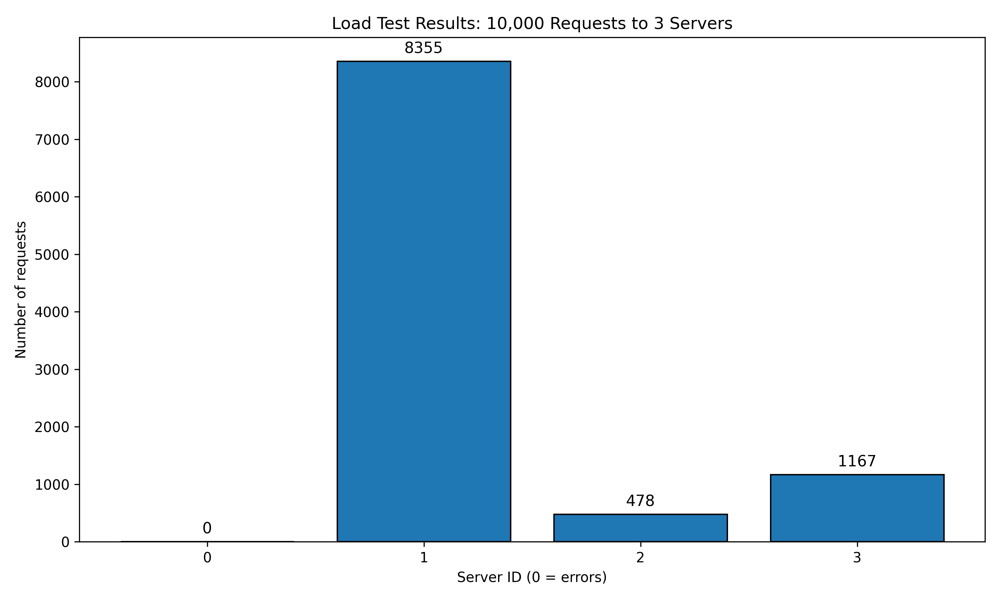
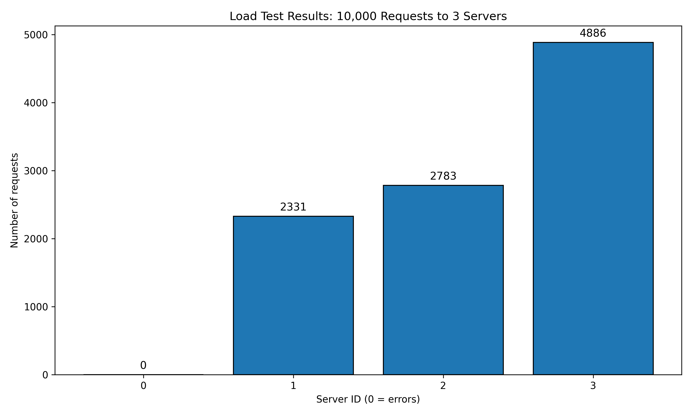

# Load Balancer with Consistent Hashing

This repository implements a load balancing system that distributes client requests among multiple server instances using consistent hashing. The system is containerized with Docker Compose and includes a load balancer, multiple server instances, and a client for load testing.

## 👥 Team Titans
**Team Members**

* Golla Meghanandh Manvith Prabhash - 22CS30027
* Sai Deepak Reddy Mara - 22CS10066
* Sadda Suchith Reddy - 22CS10063
* Gedda Sai Shasank - 22CS10025
* Emandi Devi Lakshman - 22CS10022 
---

## Overview

The system consists of the following components:

- **Load Balancer:**  
  A Python-based load balancer that uses consistent hashing (with various hash function options) to distribute incoming requests among server instances. It supports dynamic server addition and removal, heartbeat monitoring, and rebalancing.

- **Server:**  
  A simple web server implemented using Quart. Each server instance listens for client requests on the `/home` endpoint and responds with its server ID. A `/heartbeat` endpoint is also provided for health checks.

- **Client:**  
  A Python client that performs load testing by sending 10,000 requests concurrently to the load balancer. It uses `aiohttp` for asynchronous HTTP requests and generates graphs (bar charts and line graphs) to visualize the request distribution across servers.

- **Consistent Hash Map:**  
  A custom class (`ConsistentHashMap`) that manages the consistent hashing ring. It supports several hash function options (e.g.MD5) to experiment with load distribution.

## Hash Functions

The consistent hashing mechanism supports both simple polynomial hash functions and cryptographic MD5-based hash functions. These determine how requests and servers are placed on the hashing ring.

# Custom Polynomial Hash Functions

```bash
def requestHash(i):
    return i**2 + 2*i + 17  # H(i) = i² + 2i + 17

def serverHash(i, j):
    return i**2 + j**2 + 2*j + 25  # Φ(i, j) = i² + j² + 2j + 25
```

i: Request or client identifier.

j: Virtual node index of the server.

Simple and fast, but may not ensure uniform distribution under heavy load or with uneven input patterns.

# MD5-Based Hash Functions

```bash
def MD5requestHash(i):
    return int(hashlib.md5(str(i).encode()).hexdigest(), 16)

def MD5serverHash(i, j):
    return int(hashlib.md5(f"{i}-{j}".encode()).hexdigest(), 16)
```

Uses hashlib to generate MD5 hashes and converts them to 128-bit integers.

Provides better uniformity and reduced collision probability.

# Switching Hash Functions

To experiment with different hash functions, change these assignments in ConsistentHashMap.py:

```bash
self.requestHash = MD5requestHash  # or requestHash
self.serverHash = MD5serverHash    # or serverHash
```

## Repository Structure

- **load_balancer/**  
  Contains the Python code for the load balancer, including consistent hashing logic and API endpoints.

- **server/**  
  Contains the Python server application code (using Quart) that handles requests and heartbeats.

- **client/**  
  Contains the load testing script that sends requests to the load balancer and plots the results.

- **docker-compose.yml**  
  Defines the Docker services for the load balancer and server instances. By default, it includes three servers, but additional servers (Server-4, Server-5, Server-6) can be enabled by uncommenting the corresponding sections.

- **Makefile**  
  Provides common commands to build images, start containers, run tests, and clean up resources.

## Setup and Usage

### Building and Running the Containers

Build and start the containers:
```bash
make start
```

Stop and clean up:
```bash
make stop
```

### Running the Load Test

Execute the load test:
```bash
make test
```

Graphs generated by the client are saved in the `plots` directory.

### Start Interactive Client

```bash
make test_ic
```

### Modifying Hash Functions

Hash functions can be modified in `ConsistentHashMap`. Assign different implementations (`MD5` etc.) to `self.requestHash` and `self.serverHash`.

## Makefile Commands

- **start:** Build and start all Docker containers.
- **stop:** Stop and remove containers.
- **build-images:** Build the server Docker image.
- **up:** Build and run containers in detached mode.
- **test:** Run the load test using the client.
- **clean:** Clean up Docker containers and resources.

## Observations

- **Load Distribution:** Visualized using generated graphs.
- **Scalability:** Analyze by varying server numbers.
- **Hash Functions:** Experiment to find the optimal distribution.

## Troubleshooting

- Ensure port `5000` is free.
- Use `make stop` & `make clean` to resolve Docker issues.
- `Makefile` is Written for a UNIX based System.

## Output

### For 3 Servers

#### Given Hash



#### MD5 Hash



